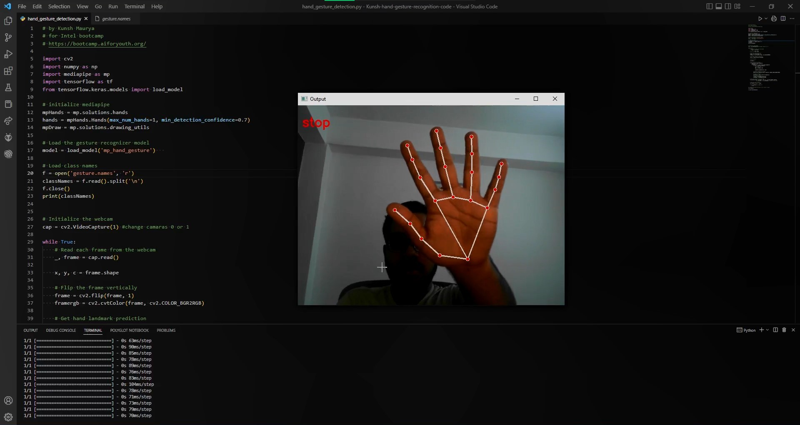

<h1> Hand Gesture Recognition using Python


## Summary
Hand/Finger gesture recognition using the Camera. The target is to detect hand objects in the digital images or videos. The detected hand objects are recognized to identify the gestures.


## Context
Hand gesture recognition is one of the most viable and popular solution for improving human computer interaction. 

In the recent years it has become very popular due to its use in gaming devices like Xbox, PS, and other devices like laptops, smart phones, etc. 

Hand Detection & gesture recognition has usage in various applications like medicine, accessibility support etc. It has many applications in virtual environment control and sign language translation, robot control, or music creation.

In this machine learning project on Hand Gesture Recognition, I am going to make a real-time Hand Gesture Recognizer using the MediaPipe framework and Tensorflow in OpenCV and Python.

## How does it work
- 1. I am using mediapipe library for hand gesture. 
- 2. Tensorflow library for machine learning by using trained data.
- 3. Using openCV for computer vision. By using input from webcam.


➡️ [Code Folder Link](https://drive.google.com/drive/folders/1i4K4lPyMav3H1BkVYgQMJj05A6zsfvwi?usp=sharing)

  ```Intel AI for youth bootcamp```

<div id="header" align="left">
  <a href="https://github.com/kunsh13">
  
  </a>
</div>
